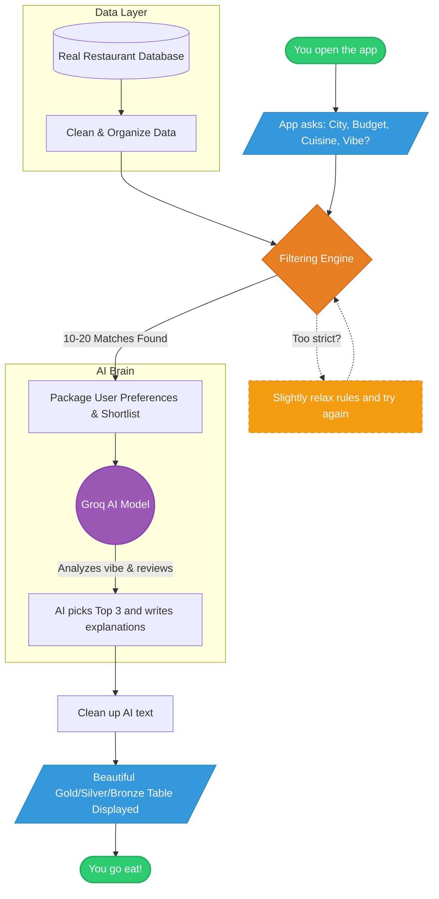

# The AI Food Place Recommender: How It Works (A Layman's Guide)

Have you ever spent more time deciding *where* to eat than actually eating? We built the AI Food Place Recommender to solve exactly that. 

Instead of infinitely scrolling through food delivery apps, you just tell our tool what you're craving, what your budget is, and where you are. The system then uses real restaurant data and a powerful Artificial Intelligence (AI) brain to give you a personalized top-3 list, complete with explanations of *why* you'll love them.

Here is a simple breakdown of how we built it, phase by phase, and how the magic happens behind the scenes.

---

## The Journey of Building It

We broke the project down into 7 main steps (or "Phases"). Here is what each phase accomplished in plain English:

### Phase 1: The Blueprint and Tools (Project Setup)
Before building a house, you need a solid foundation and the right tools. In this phase, we set up our digital workspace. We installed the necessary software libraries (like tools for handling data and connecting to the AI) and created empty folders to organize our code neatly. 

### Phase 2: Gathering the Ingredients (Data Ingestion & Preprocessing)
An AI is only as smart as the information you give it. We connected our app to a massive database of real Zomato restaurants. 
However, raw data is usually messy. Some restaurants might be missing a price, or the cuisine names might be spelled weirdly. In this phase, we wrote code to "clean" this data—fixing missing values, standardizing text, and saving a fast, clean copy locally so the app runs lightning-fast the next time you open it.

### Phase 3: Asking What You Want (User Input & Validation)
This is where you come in! We built a friendly text interface (like a chat window in your terminal) that asks you a few simple questions:
* Where are you? (e.g., "Indiranagar")
* What's your budget? (Low, Medium, or High)
* What are you craving? (e.g., "Chinese")
* Do you have any extra preferences? (e.g., "Outdoor seating" or "Family friendly")

We also made sure the system is forgiving. If you make a typo, it understands and corrects it.

### Phase 4: The Great Sieve (Filtering Engine)
Imagine having 12,000 restaurants. We can't ask the AI to read all of them—it would take too long and be too expensive. 
So, our Filtering Engine acts like a giant sieve. It instantly drops any restaurants that aren't in your chosen area, don't serve your cuisine, or are too expensive. 

**The Smart Part:** What if you ask for something too specific, and no restaurants match? Instead of just saying "Sorry, nothing found," our engine *relaxes* the rules slightly. It might increase your budget a tiny bit, or slightly lower the minimum rating, just to make sure you still get some great options!

### Phase 5: The AI Brain (Groq Integration & Prompt Builder)
Now we have a short list of, say, 15 perfect candidates. We take your exact preferences (including the specific vibe you asked for, like "romantic dinner") and our shortlist of 15 restaurants, and we package them into a neatly written "Prompt" (a set of instructions). 
We securely send this prompt to **Groq**, a lightning-fast, state-of-the-art AI model. We ask the AI: *"Out of these 15 restaurants, which 3 are the absolute best for this specific user, and why?"*

### Phase 6: Making It Look Good (Response Formatter & Output Display)
The AI sends back its answer, but AIs sometimes format their text weirdly. In this phase, we built a "Formatter" that carefully extracts the exact recommendations and cleans them up. 
Then, we use a tool to draw a beautiful, color-coded table right on your screen, complete with Gold 🥇, Silver 🥈, and Bronze 🥉 medals for the top three spots!

### Phase 7: Bulletproofing (Testing & Hardening)
What if the internet goes down? What if the AI server is busy? In this final step, we tested the app against all sorts of disasters to make sure it doesn't just crash. We added "graceful fallbacks" so that if something goes wrong, the app politely tells you what happened and tries to recover.

---

## The Big Picture: How It Actually Works When You Press "Run"

When you use the app, all of the phases above work together in a seamless pipeline that takes less than 3 seconds! 

Here is a visual map of the journey your request takes:

### Summary of the Flow:
1. **You ask** for what you want.
2. **We filter** the massive database down to a manageable shortlist of highly relevant options.
3. **The AI analyzes** that shortlist against your nuanced requests (like "good ambiance").
4. **We display** the final AI-curated winners in a beautiful format.
